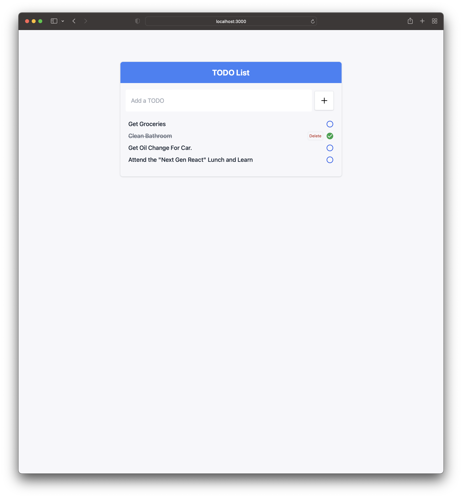

# Next Generation React

Developer experience is an often overlooked aspect of software development but it is crucial to keeping developers productive. This repository demonstrates how to setup a React web app stack with Vite centric tools that dramatically decrease boot, build and test times. If you have any questions regarding this repository, contact [Sunny Golovine](mailto:sunny.avery@ascendum.com).

## Tools

This project uses the following development tools:

- [PNPM](https://pnpm.io/): A package manager that is faster and more disk space efficient than NPM or Yarn.

- [Vite](https://vitejs.dev/): A bundler built on top of [ESBuild](https://esbuild.github.io/).

- [Ladle](https://ladle.dev/): An alternative to [Storybook](https://storybook.js.org/) and is built on Vite.

- [Vitest](https://vitest.dev/): Drop in alternative to [Jest](https://jestjs.io/) that runs with Vite.

## Code Examples

Below are several code examples for testing and stories:

- [Sample Ladle Story](/src/stories/TodoInput.stories.tsx)

- [Sample Vitest Test File](/src/__tests__/TodoInput.test.tsx)

## Getting Started

To run this project, you should first make sure that you have NodeJS installed, then install PNPM via NPM:

```bash
npm install -g pnpm
```

From there clone the repository, install dependencies and then run the project.

```bash
# Clone the respository
git clone git@github.com:vora/nextgen-react.git

# Install dependencies
pnpm install

# Run the app in development mode
pnpm run dev
```

## Running Ladle

Ladle is an alterative to Storybook that supports [CSF (Component Story Format)](https://storybook.js.org/docs/react/api/csf). To run Ladle, make sure you have followed [Getting Started](#getting-started). From there, start or build ladle.

```bash
# Will start ladle
pnpm run ladle

# Will build ladle (production build)
pnpm run build-ladle
```

## Building for Production

This app can also be build for production. In order to build for production make sure you follow [Getting Started](#getting-started), then run the following:

```bash
# build a production bundle to /dist
pnpm run build

# (optional) serve the production bundle
pnpm run serve

```
